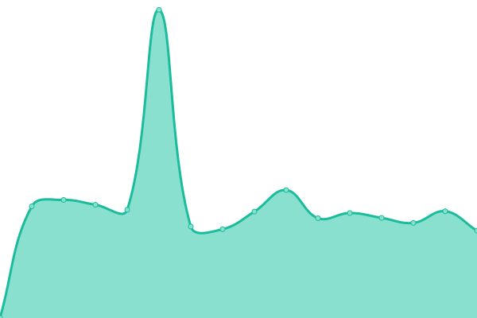
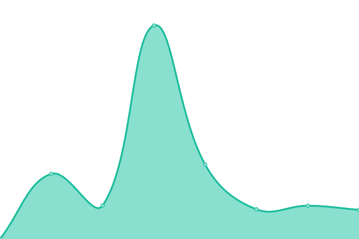

# [📈 Live Status](https://status.pt-infra.net): <!--live status--> **🟩 All systems operational**

This repository contains the open-source uptime monitor and status page for [Phạm Tiến Thành](https://pt-infra.net), powered by [Upptime](https://github.com/upptime/upptime).

With [Upptime](https://upptime.js.org), you can get your own unlimited and free uptime monitor and status page, powered entirely by a GitHub repository. We use [Issues](https://github.com/tienthanh2509/pt-infra-status/issues) as incident reports, [Actions](https://github.com/tienthanh2509/pt-infra-status/actions) as uptime monitors, and [Pages](https://status.pt-infra.net) for the status page.

<!--start: status pages-->
<!-- This summary is generated by Upptime (https://github.com/upptime/upptime) -->
<!-- Do not edit this manually, your changes will be overwritten -->
<!-- prettier-ignore -->
| URL | Status | History | Response Time | Uptime |
| --- | ------ | ------- | ------------- | ------ |
|  [TDMU Elearning](https://elearning.tdmu.edu.vn) | 🟩 Up | [tdmu-elearning.yml](https://github.com/tienthanh2509/pt-infra-status/commits/HEAD/history/tdmu-elearning.yml) | 

 4787ms
     
 | 

<a href="https://status.pt-infra.net/history/tdmu-elearning">97.83%</a>
    

|  [TDMU Elearning SSO](https://sso.tdmu.edu.vn) | 🟩 Up | [tdmu-elearning-sso.yml](https://github.com/tienthanh2509/pt-infra-status/commits/HEAD/history/tdmu-elearning-sso.yml) | 

 1884ms
     
 | 

<a href="https://status.pt-infra.net/history/tdmu-elearning-sso">100.00%</a>
    

|  [TDMU Elearning Chat](https://chat.tdmu.edu.vn) | 🟩 Up | [tdmu-elearning-chat.yml](https://github.com/tienthanh2509/pt-infra-status/commits/HEAD/history/tdmu-elearning-chat.yml) | 

 2273ms
     
 | 

<a href="https://status.pt-infra.net/history/tdmu-elearning-chat">100.00%</a>
    

|  [TDMU Elearning ePortfolio](https://eportfolio.tdmu.edu.vn) | 🟩 Up | [tdmu-elearning-e-portfolio.yml](https://github.com/tienthanh2509/pt-infra-status/commits/HEAD/history/tdmu-elearning-e-portfolio.yml) | 

 1703ms
     
 | 

<a href="https://status.pt-infra.net/history/tdmu-elearning-e-portfolio">100.00%</a>
    

<!--end: status pages-->

[**Visit our status website →**](https://status.pt-infra.net)

## 📄 License

- Powered by: [Upptime](https://github.com/upptime/upptime)
- Code: [MIT](./LICENSE) © [Phạm Tiến Thành](https://pt-infra.net)
- Data in the `./history` directory: [Open Database License](https://opendatacommons.org/licenses/odbl/1-0/)
